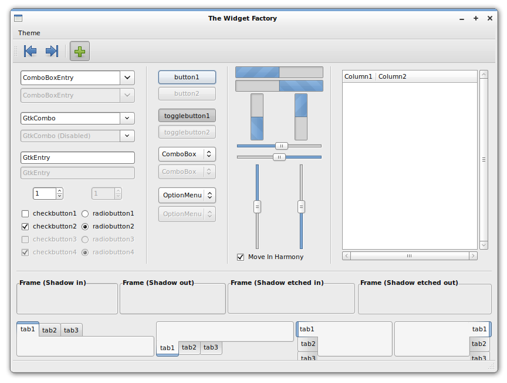
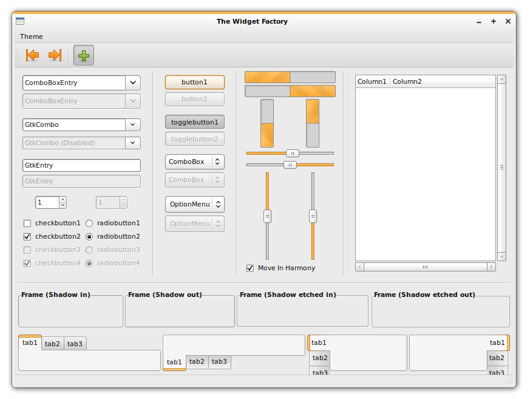
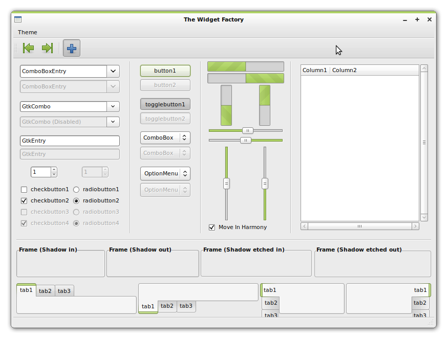

# Clearlooks-Colors

GTK2 Themes

This theme is aimed for people who just want a simple, fast and native interface with many color options. It's also designed with new linux users in mind, by providing simple, thorough instructions. A matching set of Icons, Wallpapers, GDM themes and Usplash screens can also be downloaded separately.

There are four color variations (Orange, Blue, Green, Red) and TWO designs; light and dark. You can create even more color-schemes through GNOME's appearance preferences, using the included tango palette for color suggestions!

This theme is designed for Ubuntu Hardy/Gnome 2.22. It will not work in earlier versions.








## Important, must read or clowns will eat you:

  - Inside the gtkrc files there are extensive line-by-line instructions and tips for customizing most aspects of the theme!
  - GNOME-Colors are set as the default icons for the themes. Be sure to download them to get the full experience!
  - This theme uses gradient panel backgrounds by default. If you plan to use Transparent/Custom panels, please disable my panels by editing either the gtkrc or panel.rc files like the included instructions tell you to.
  - My X-Colors metacity borders are not selected by default, due to their non-conservative nature. You can choose them in gnome's appearance preferences if you wish to use them.
  - Some linux apps are not too friendly to dark themes yet. It's up to their developers to improve this. Keep this in mind when using any dark theme.
  - If you want root/super user applications to be themed, you must type in a terminal:
    ```bash
    sudo ln -s ~/.themes /root
    ```
  - Feel free to try Murrine-Colors or Nodoka-Colors for alternate takes on this theme.


## Last changelog:

### 2.0 (09/12/08):

  - Minor improvements.
  - Minor improvements to metacities/emeralds.
  - Now based on Shiki-Colors' newer gtkrc, for better instructions and easier modifications.
